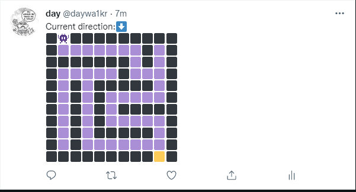

# Twitter Saves Nu

A twitter bot that allows users to play a game together by liking or retweeting the post. 

***

## Controls
- retweets to turn Nu clockwise
- likes to turn Nu counter-clockwise

``` 
      N
      ^             //e.g if Nu is facing N 
      |             //and likes > retweets move him W
W <-     -> E
      |
      v
      S
```
---
## Features
- DFS random maze generator
- Implemeting the Twitter4J library

---
## Improvements
- I think the controls can be optimized
- Some tile system can be used to make the code cleaner

## Demo



